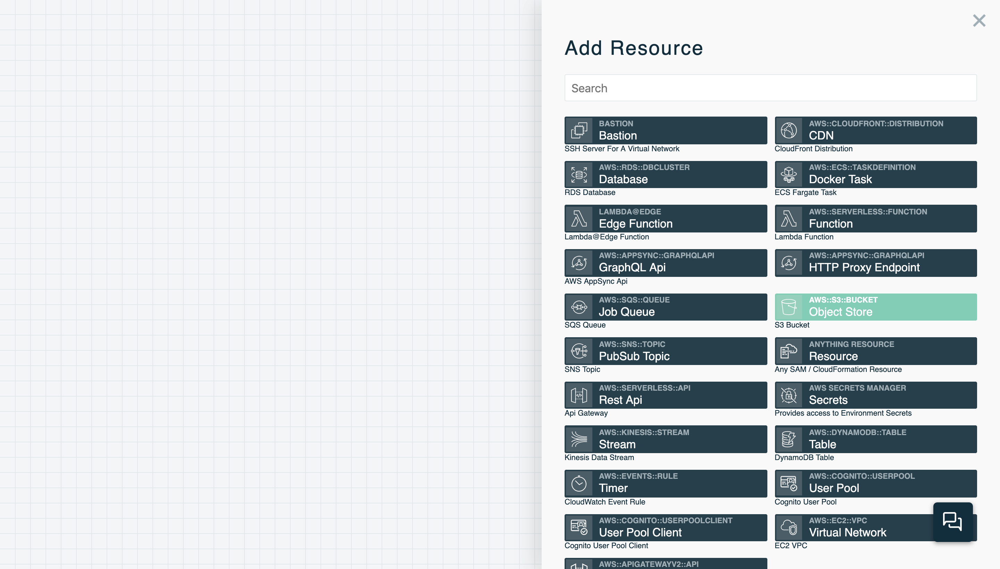
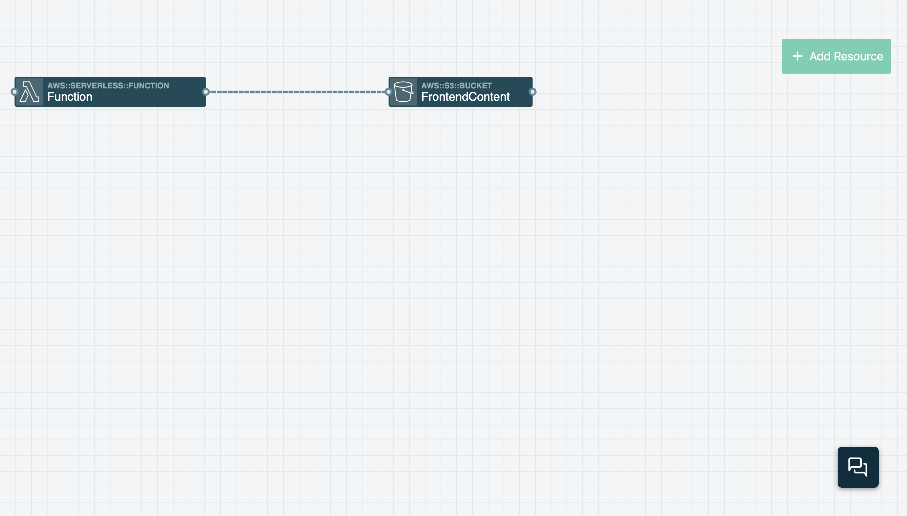
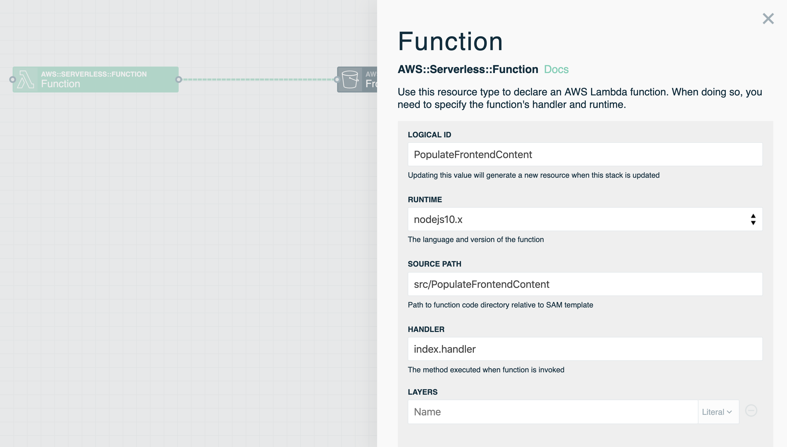
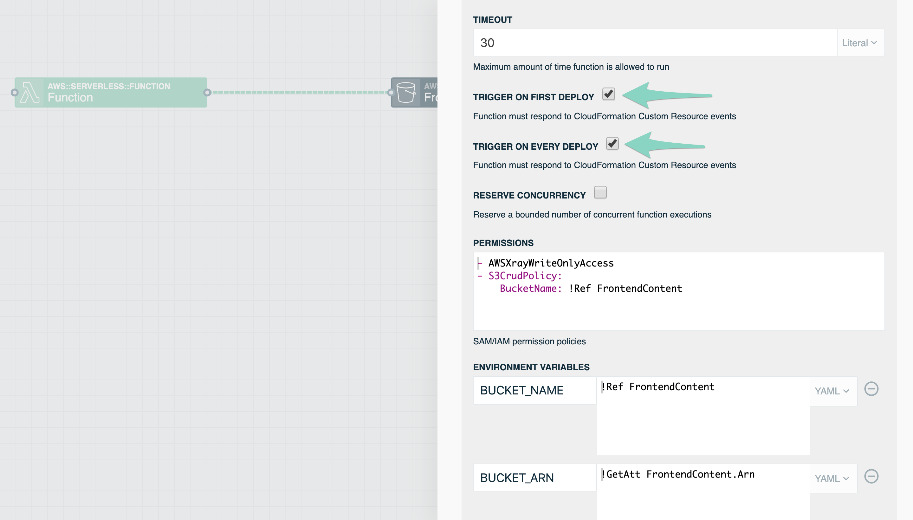

# Frontend Content
In this step of the workshop you will create and deploy the *Wild Rydes* frontend. The frontend is composed of an AWS S3 bucket and an AWS Lambda function that is triggered on deployment which will populate the S3 bucket with the *Wild Rydes* static content.

## AWS Services

<!-- FIXME: link to Stackery resource docs? -->

* AWS S3
* AWS Lambda
* AWS Cloudformation

## Instructions

### 1. Add an Object Store resource
Add an *Object Store* resource (an AWS S3 Bucket) to serve the website content. Click the **Add Resource** button in the top right of screen to reveal the resources menu. Then click on the *Object Store* resource to add it to the canvas and your application stack. Alternatively you can also drag and place the resource on the canvas.



Next, double-click on the Object Store resource on the canvas to edit its settings. Set the **DISPLAY NAME** and **CLOUDFORMATION LOGICAL ID** fields to `FrontendContent`. Then click **ENABLE WEBSITE HOSTING** and leave the value of **INDEX DOCUMENT** as `index.html`. Finally save the Settings.


Click the **Commit** button on the left side of the screen to review your changes. The click **Commit and Push** to save your changes and push them to GitHub.

### 2. Add a Function resource
Add a Function resource (an AWS Lambda Function) to update the website's static content. This function will copy the contents of a directory in the project source code to the Object Store we've just configured. You will also configure this Function resource to be triggered on every deployment of the stack.

From the *Add Resources* menu (found buy clicking *Add Resource*), click a Function resource to add it to the stack.


Next drag a wire from the Function to the *FrontendContent* Object Store. **Make sure to drag the wire from the right end of the Function resource and connect it to the left end of the Object Store resource**. The line you are dragging should be a dotted line and not a solid line if you've done this correctly. This distinction is necessary because we want to indicate that the Function resource needs permissions to access the Object Store resource, not that the Object Store resource is an event trigger for the Function.



To tell if you've drawn the relationship correctly, double-click on the Function resource and scroll down to **ENVIRONMENT VARIABLES**. You should see the variables `BUCKET_NAME` and `BUCKET_ARN` defined.


Next in the Function's settings, for the **DISPLAY NAME** and **LOGICAL ID** fields enter the value `PopulateFrontendContent`. Then update the **SOURCE PATH** field to `src/populateFrontendContent`. This path is where Stackery will create a scaffold for the function code inside the Git repository.




Scroll further down in the settings and check the **TRIGGER ON FIRST DEPLOY** and **TRIGGER ON EVERY DEPLOY** box. This will create an [AWS CloudFormation CustomResource](https://docs.aws.amazon.com/AWSCloudFormation/latest/UserGuide/aws-resource-cfn-customresource.html) in the stack that will trigger the function on deployments and updates. After you've done this, click the **Save** Button.



Click the **Commit** button on the left side of the screen to review your changes. The click **Commit and Push** to save your changes and push them to GitHub.


### 3. Clone the application repository and workshop locally

Clone your application repository using Git via the command line or favorite IDE / development tool to your computer. You will now locally edit the code of the _populateFrontendContent_ function. In the upper left of your screen underneath the stack name is a link to your code repository. Click the link to navigate to it and follow the GitHub instructions for cloning it to your computer.

*NOTE: Do not use the URL in the example screenshot below. Use your own project's URL*


```
git clone <YOUR_PROJECT_URL>
```

If you browse the contents of the project directory you will notice the repository has a scaffold for the _PopulateFrontendContent_ Function resource in _src/populateFrontendContent_

```
$ tree stackery-wild-rydes
stackery-wild-rydes/
├── src
│   └── populateFrontendContent
│       ├── README.md
│       ├── index.js
│       └── package.json
└── template.yaml
```

Next clone this workshop to your computer. You will be copying code from the workshop repository into your own application stack.

```
git clone https://github.com/stackery/wild-rydes-workshop.git wild-rydes-workshop
```

Copy the following files and directories from the workshop to your application stack's directory.

* [src/populateFrontendContent/index.js](./src/populateFrontendContent/index.js)
* [src/populateFrontendContent/package.json](./src/populateFrontendContent/package.json)
* [src/populateFrontendContent/static/](./src/populateFrontendContent/static/)

You can do this by running the following commands on Linux or MacOS.

```bash
cp wild-rydes-workshop/src/populateFrontendContent/index.js stackery-wild-rydes/src/populateFrontendContent
```
```bash
cp wild-rydes-workshop/src/populateFrontendContent/package.json stackery-wild-rydes/src/populateFrontendContent
```
```bash
cp -R wild-rydes-workshop/src/populateFrontendContent/static stackery-wild-rydes/src/populateFrontendContent
```

Finally, commit the new code and push it back up to your git repository.

```
cd stackery-wild-rydes
git add src/populateFrontendContent
git commit -m "Add populateFrontendContent function"
git push
```

### 4. Deploy the stack
You'll now deploy the *stackery-wild-rydes* stack to AWS. Stackery will package your code repository and deploy it using AWS CloudFormation.

If you are still in the **Edit** view in Stackery, you'll notice the app has detected your remote changes. Click the **refresh** link to ensure you're on the latest version:


Then, click the **Deploy** view in the left sidebar to enter the *Deploy* view. Next click **Prepare new deployment** for the **development** environment.


For the **branch or SHA** value enter `master` (if it's not already there) and then click **Prepare Deployment**.


Once the preparation completes (this should take about 20 seconds) the **Prepare Deployment** button will now say **Deploy**. Click the button to open AWS CloudFormation. Then click the **Execute** button in the CloudFormation Console to provision the Object Store (S3 Bucket) and Function (Lambda) resources.


### 5. View the website

Now you can visit your Wild Rydes website that you have deployed.

Once the deployment is complete, switch to the **View** view in the left sidebar of Stackery. Double-click the *FrontendContent* Object Store resource to view its details. On the details slide-in click on the **Website Hosting Address** link to open the website.


The website should appear, though it's missing resources it needs to be fully functional.


## Next Steps

Proceed to the next module in this workshop:

* [User Management](./02-user-management.md)

