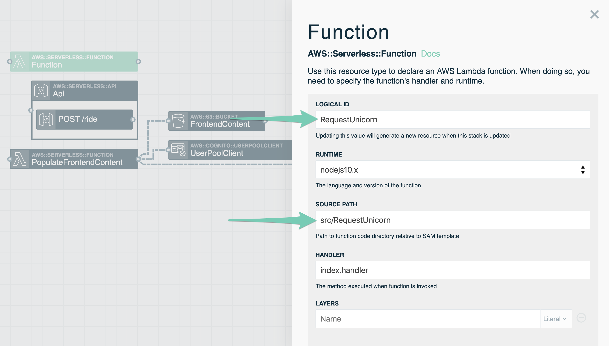
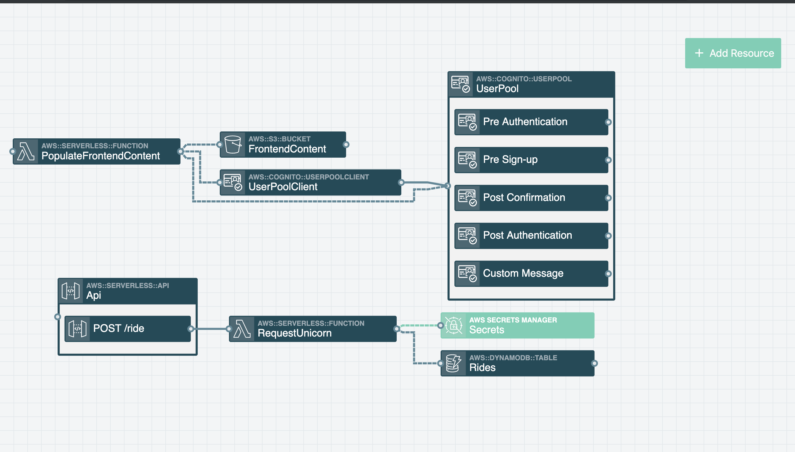
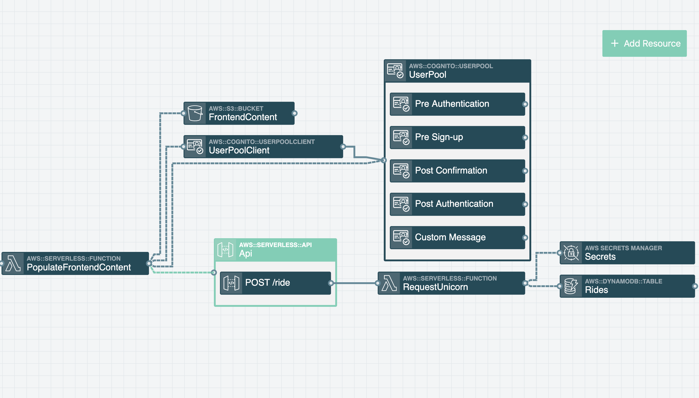

# Backend API
You'll now add the backend service for handling ride requests from *Wild Rydes* users. You'll create an HTTP API that will take requests from your frontend. The backend willl reserve a unicorn and direct it to your user's location. Your backend API will use API Gateway to handle HTTP requests plus a Lambda function to process the request. You'll also see the Stackery environment variables you previously configured.

## AWS Services

<!-- FIXME: link to Stackery resource docs? -->

- AWS API Gateway
- AWS Lambda
- AWS Systems Manager (SSM) Parameter Store.
- AWS Secrets Manager


## Instructions
Go back to the *stackery-wild-rydes* stack editor. Start by clicking on **STACKS** in the upper left menu bar, then select the *stackery-wild-rydes* stack, and finally clicking on **EDIT** on the left sidebar.


### 1. Add a Rest API resource
Add a Rest API resource to the application stack. Click **Add Resources** and then click on the Rest Api resource. This will add an AWS API Gateway to your stack which will handle web requests to the backend service.

<!-- FIXME: We should explain CORS -->
Click on the newly added resource, which should be named *Api*, to open up it's configuration. Modify the **Routes** setting so there is one route, a `POST` action to the `/ride` endpoint.


Next check off **ENABLE CORS**. Next to the **CORS ACCESS CONTROL HEADERS** box change the dropdown  menu from `Literal` to `YAML`. You will then add the following to the **CORS ACCESS CONTROL HEADERS** box and then click the **Save** button.

```
AllowOrigin: '''*'''
AllowHeaders: '''Authorization,Content-Type'''
```


### 2. Add a Function resource to service API requests

When a *POST* request is made to the */ride* endpoint it should trigger a Lambda function to perform an action. You will add this function and connect the *Api* resource to this function so a web request will trigger it.

Add a Function from the *Add Resources* menu and then click on the newly added resources in the visual editor. Change **LOGICAL ID** to `RequestUnicorn` and **SOURCE PATH** to `src/requestUnicorn`.




Scroll down to **ENVIRONMENT VARIABLES**. Add one named `UNICORN_STABLE_API`. On the right in the dropdown that says **Literal** change it to **Param** and then enter the value `unicornStableApi`. Then click **Save**.


Next, draw a line from the *POST /ride* resource inside the *Api* resource to the *RequestUnicorn* Function.


### 3. Add a Table resource for saving ride records

Add a Table resource from the *Add Resources* menu and click on it to open the table's configuration. For **LOGICAL ID** enter `Rides` and for **HASH KEY NAME** enter `RideId` and then save settings.


Next drag a wire from the *RequestUnicorn* Function to the *Rides* Table. This will add the `TABLE_NAME` environment variable so the function can access the table and adds permissions for the function to manipulate records.


### 4. Add a Secrets resource to *RequestUnicorn* Function

Add a Secrets resource from the *Add Resources* menu to allow the *RequestUnicorn* Function to access the Unicorn Stables™ API key.  Drag a wire from the *RequestUnicorn* Function to the new Secrets resource. This adds a permission for the function to read secrets from AWS Secrets Manager. It also adds an environment variable `SECRETS_NAMESPACE` to make it easier to locate the correct secrets for the environment the stack is deployed into.




### 5. Point *PopulateFrontendContent* Function to the *Api* URL.

Drag a wire from the *PopulateFrontendContent* Function to the *Api* resource. Doing this adds the `API_URL` environment variable to the function. The *PopulateFrontendContent* Function uses the environment variable to generate *js/config.js* as part of the website content.




### 6. Authorize requests using the User Pool Client

Requests to *POST /ride* must have a valid User Pool authentication token in the `Authorization` header. Unfortunately, this is something that isn't nicely abstracted by AWS SAM yet, so we will manually edit the *Api* resource settings.

Start by changing from the *Visual* to *Template* editor mode by clicking on **Template** in the upper left. In the template editor find the *Api* resource (it will be named *Api* and have a *Type* attribute with the value `AWS::Serverless::Api`). You can use *Ctrl+f* to search the file for this. Add the following authentication configuration under the *Properties* key.

```YAML
Auth:
  Authorizers:
    WildRydes:
        UserPoolArn: !GetAtt UserPool.Arn
```

Next locate the *POST /ride* route under *DefinitionBody -> paths -> /ride -> post* path in the YAML and add the following *security* property:
```YAML
security:
    - WildRydes: []
```
The complete *Api* resource definition look like it does below. *(NOTE: that the order of the properties doesn't matter)*
```YAML
  Api:
    Type: AWS::Serverless::Api
    Properties:
      Auth:
        Authorizers:
          WildRydes:
            UserPoolArn: !GetAtt UserPool.Arn
      Name: !Sub
        - ${ResourceName} From Stack ${StackTagName} Environment ${EnvironmentTagName}
        - ResourceName: Api
      StageName: !Ref EnvironmentAPIGatewayStageName
      DefinitionBody:
        swagger: '2.0'
        info: {}
        paths:
          /ride:
            post:
              security:
                - WildRydes: []
              x-amazon-apigateway-integration:
                httpMethod: POST
                type: aws_proxy
                uri: !Sub arn:aws:apigateway:${AWS::Region}:lambda:path/2015-03-31/functions/${RequestUnicorn.Arn}/invocations
              responses: {}
      EndpointConfiguration: REGIONAL
      Cors:
        AllowOrigin: '''*'''
        AllowHeaders: '''Authorization,Content-Type'''

```

Finally, commit your changes by clicking the **Commit** button and in the popup window clicking **Commit and Push**.


### 7. Update *RequestUnicorn* Function.

Update the *RequestUnicorn* Function code so it is functional. The code accepts requests and performs the following actions:

* Validates the User Pool Client authentication token (provided via the *Authorization* header from API Gateway) and retrieves the username from it
* Retrieves the Unicorn Stables™ API key from AWS Secrets Manager and caches the value for subsequent requests
* Makes a request to the Unicorn Stables™ endpoint to rent a unicorn
* Records the ride to the *Rides* DynamoDB table
* Returns with the response to the frontend website request

Start by updating your local *stackery-wild-rydes* GitHub clone (created in module 1) so it has all the changes you've made over the past few workshop modules.

```
$ cd stackery-wild-rydes     # if not already in the directory.
$ git fetch origin
$ git rebase origin/master
```

Now copy [src/requestUnicorn/index.js](src/requestUnicorn/index.js) from the workshop directory (also created in module 1) into your project directory.

*Note: Make sure you are still in the stackery-wild-rydes project directory when you run the following command.*
```
$ cp ../wild-rydes-workshop/src/requestUnicorn/index.js ./src/requestUnicorn/index.js
```

```
$ git add src/requestUnicorn/index.js
$ git commit -a -m "add requestUnicorn"
$ git push -v
```


### 8. Deploy updated Wild Rydes

You'll now deploy the updated *stackery-wild-rydes* stack. Click **Deploy** in the left sidebar to enter the Deploy view. Next click **Prepare new deployment** for the **development** environment. For the **branch or SHA** value enter `master` and then click **Prepare Deployment**. Once the preparation completes (this should take about 20 seconds), click the **Deploy** button to open AWS CloudFormation. Then click the **Execute** button in the CloudFormation Console.


### 9. Request a unicorn

Head back to the *Wild Rydes* website. If the error message from module 2 is still up, refresh the page. Then right click on the map to drop a pin. After that click **Request Unicorn**. A unicorn will fly in from the edge of the screen towards your location pin.


