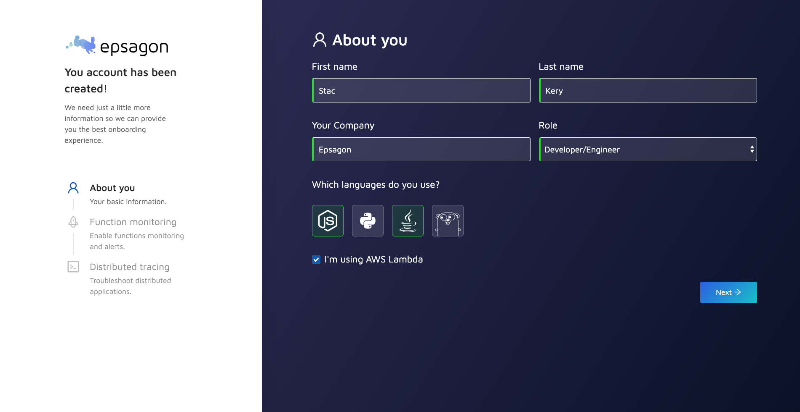
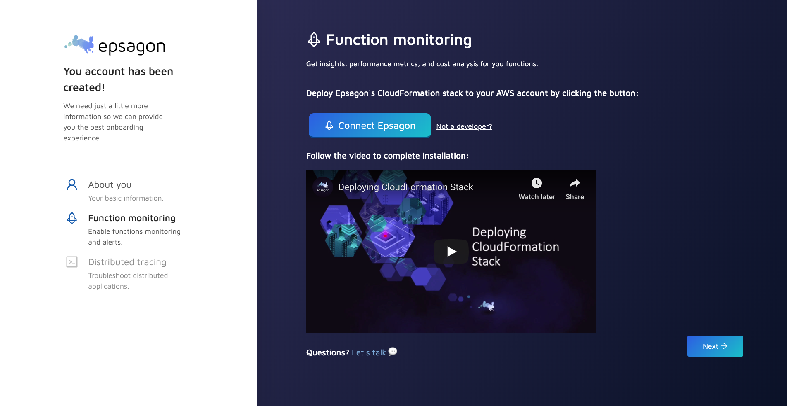
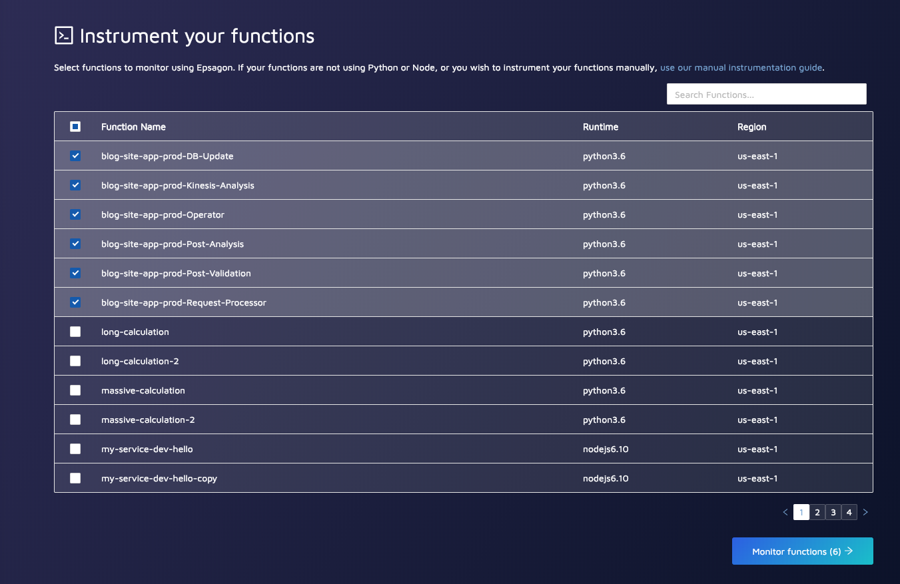
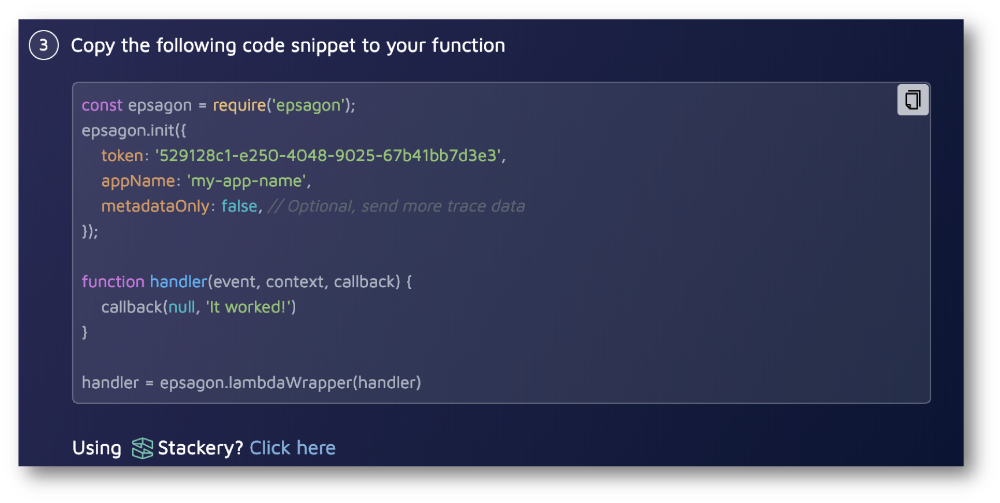
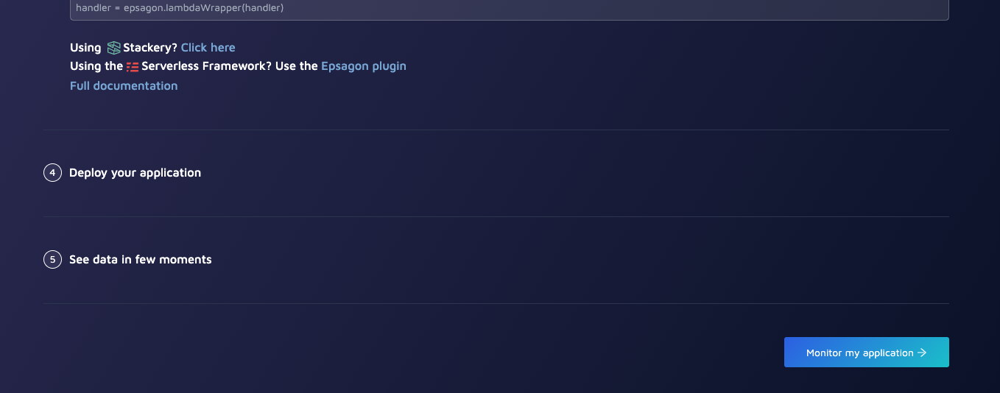
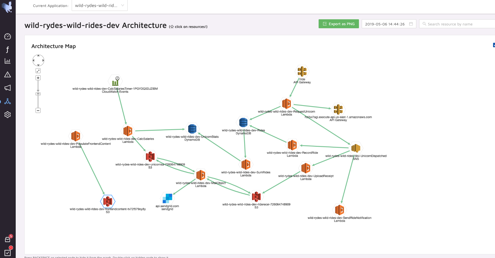

# Application Observability
In this module, you will integrate [Epsagon](https://epsagon.com) with your
Stackery application.

# Instructions
### 1. Update the application 
In this step, we will use a more complex serverless application. to deploy it,
switch to the `monitoring` branch of this repository:

```bash
cd ../wild-rydes-workshop/
git fetch
git checkout monitoring
cd -
```

Now copy the content over to your local application:
```bash
cp ../wild-rydes-workshop/src ../wild-rydes-workshop/template.yaml .
```

Commit and push the changes:

```bash
git add -A
git commit -m "Added monitoring content"
git push -v
```

### 2. Integrate Epsagon
Next, let's integrate Epsagon to our application. To get started with Epsagon,
take the following steps. A more detailed guide can be found at 
[the Epsagon documentation](https://docs.epsagon.com/docs/quickstart)

#### Create an Epsagon account
Click on the link below to bring you to the Epsagon signup page.

* [Create an Epsagon Account](https://dashboard.epsagon.com/signup)


#### Tell us a bit about yourself
Once you created your account, Epsagon will guide you the integration. First,
fill in some details:


#### Link Epsagon to your AWS account
Next, we will link Epsagon to our AWS account. To do so all that is required
is deploying our CloudFormation to your account. A more detailed walkthrough
of this step can be found
[here](https://docs.epsagon.com/docs/aws-lambda-monitoring)


### Integrate Epsagon with Stackery
Next, you should land at the instrumentation step, which will let us trace our
functions:


Since we will be using Stackery's integration to take care of the instrumentation
for us, click on **"use our manual instrumentation guide"**.<br>
Click the Stackery integration link:


“Clicking here” will open your Stackery dashboard and place the Epsagon token
for you!


A full documentation of this step can be found
[here](https://docs.epsagon.com/docs/stackery)


### 3. Deploy updated Wild Rydes
You'll now deploy the updated *stackery-wild-rydes* stack. In the **Edit** view, refresh your stack as you have made remote changes. Click **Deploy** in the left
sidebar to enter the Deploy view. Next click **Prepare new deployment** for the 
**production** environment. For the **branch or SHA** value enter `master` and 
then click **Prepare Deployment**. Once the preparation completes (this should
take about 20 seconds), click the **Deploy** button to open AWS CloudFormation.
Then click the **Execute** button in the CloudFormation Console.


### 4. Start monitoring with Epsagon
Now that the integration is Done, you can click the "Monitor my application"
in Epsagon to get to the Epsagon dashboard:


Epsagon will automatically start monitoring your application. Order some
unicorn rides, and let's see what's going on in Epsagon!


### 5. View your application
Epsagon will trace the invocations of your application. The first thing we will
use it for is to get an understanding of how our application looks in real life.
Click on the
[Architecture map](https://dashboard.epsagon.com/applications/stackery-wild-rydes-production/architecture)
to have an overview of your application's architecture:


Explore the different functions' stats and invocations in your account using the
[Functions](https://dashboard.epsagon.com/functions) page


## Next Steps
Proceed to the next module in this workshop:

* [Troubleshooting & Distributed Tracing](07-troubleshooting-distributed-tracing.md)

