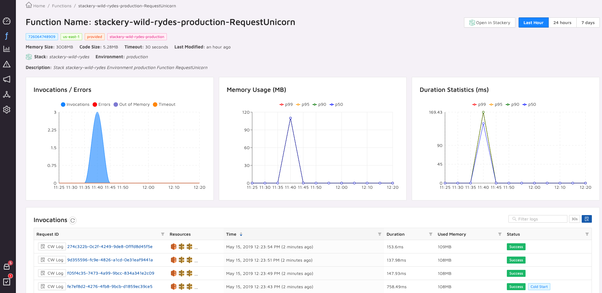
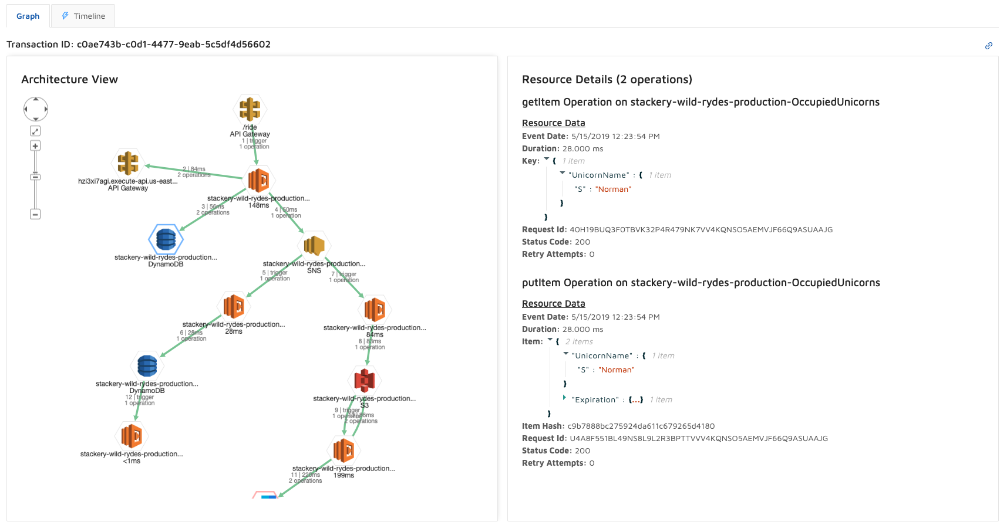
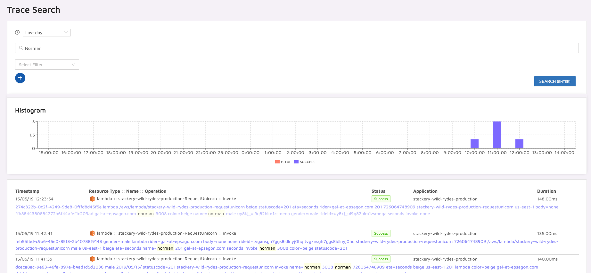
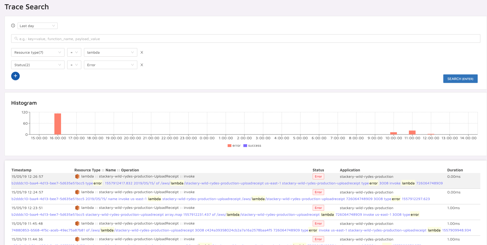

# Distributed Tracing & Troubleshooting
In this module, we will explore the power of distributed tracing, and learn how to troubleshoot using Epsagon.

## Instructions
### 1. Invoke the application
Here, we will simulate users using the application. Send some consecutive requests, until you receive some "Unicorn not available" notifications. 


### 2. Inspect the transactions using Epsagon
With Epsagon, we can trace the entire flow of the data throughout the application. We will start with a successful transaction.

First, enter the [Functions](https://dashboard.epsagon.com/functions) page and select `stackery-wild-rydes-production-RequestUnicorn`. there you can see all the API invocations in the system.


Then, select a successful invocation. Note that you can drill into the data of every event.



### 3. Search for transactions
Using Epsagon, you can filter the transactions in your system based on the data they contain. Let's give it a shot.

Search for all the transactions where a unicorn with a specific name was dispatched. To do that, we can use the [Event search](https://dashboard.epsagon.com/search). Search for all the transactions for your favorite unicorn:



### 4. Troubleshoot an error
Next, select a transaction with an error. Troubleshoot the root cause of the error using it (don't fix it yet). You can filter errors in the system using the [Event search](https://dashboard.epsagon.com/search). Search for all the events with resource type `lambda` and status `Error`:


Another way to view the issues in your application is the  [Issue manager](https://dashboard.epsagon.com/issues):


What is causing the error? Find the root cause!
<details>
<summary> Open to reveal the solution</summary>
<br>
When a user requests a unicorn and the selected one is not available (the `OccupiedUnicorns` DB reports it as busy), a message is still being dispatched to the `UnicornDispached` SNS! This causes a faulty message to pass downstream and the next function malfunctions.
</details>

### 5. Manually reporting errors
The `SumRides` function is a stream handler. Stream Handlers are often wrapped with a try/catch block to prevent the stream from getting stuck. The previous error caused an issue with it as well. To view the error in Epsagon (without having the Lambda raising an exception and blocking the stream) we can simply report it.

Change the function code to report the error to Epsagon. First, require Epsagon (no need to install it, Stackery will make sure it is there):

```javascript
const epsagon = require('epsagon')
```
Then, in the catch block of the main handler function, simply call `setError`
```javascript
  try {
  // original code
  } catch (e) {
    epsagon.setError(e)
  }
```

### 6. Optional - fix the error
Fix the error! Don't publish the SNS message when a unicorn is not available!

## Next Steps

Proceed to the next module in this workshop:

* [Monitoring](08-monitoring.md)
