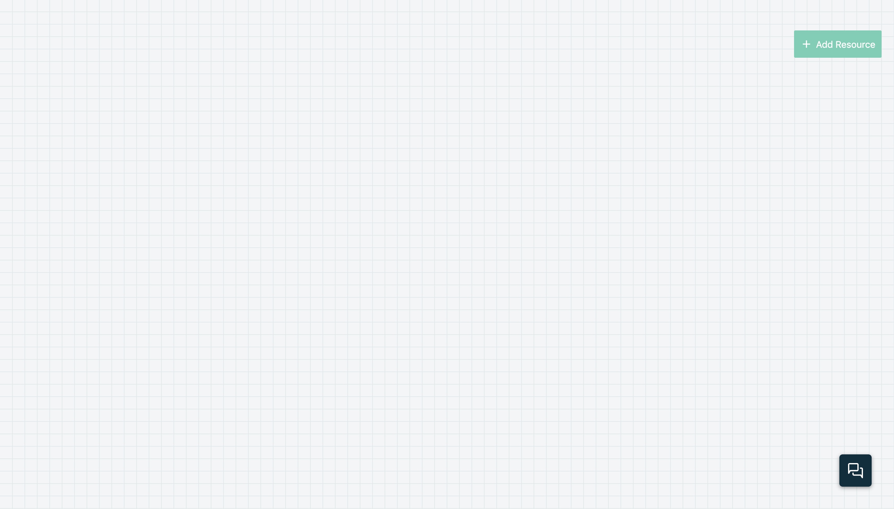

# Wyld Rides With Stackery

In this workshop you will deploy a simple serverless application using [Stackery](https://stackery.io). The application is a unicorn ride hailing service called Wild Rydes. The Wild Rydes application is a three tier web application composed of a frontend web application, a RESTful web services backend API, and a NoSQL data layer. This workshop will also cover common topics for building serverless applications like secrets management and user authentication, authorization, and management.

The application architecture uses the following AWS services.

* [Lambda](https://aws.amazon.com/lambda/) - Backend API compute
* [API Gateway](https://aws.amazon.com/api-gateway/) - Backend HTTP interface
* [DynamoDB](https://aws.amazon.com/dynamodb/) - NoSQL datastore
* [S3](https://aws.amazon.com/s3/) - Object store for hosting frontend.
* [Cognito](https://aws.amazon.com/cognito/) - user management, authentication, and authorization.

## Setup / Prerequisites

To complete this workshop you will need the following:

* Software:
  * [Git](https://git-scm.com/downloads)
  * A text editor or programming IDE
* Accounts
  * GitHub
  * AWS
  * Stackery

At a minimum you will probably need to create a Stackery account. Follow the instructions below to setup what you need to get started and complete this workshop.

### 1. Create a Github account
If you do not already have a GitHub account, create one. You will store the workshop's code in Github. Stackery will also deploy your code from GitHub. _NOTE: Stackery supports multiple code repository platforms such as Gitlab, Bitbucket, and AWS CodePipeline. This workshop uses GitHub only to simplify instructions but you are free to choose one of the other supported providers._

Create a free individual account by clicking on the link below. On that page you will create a username, enter your email, and set a password for your account.

* [Create a GitHub account](https://github.com/join?source=pricing-ca)

### 2. Create an AWS account

Create an AWS account if you do not already have one. The workshop's application is built to run in AWS.

To create an AWS account, click on the link below and follow the signup screens. You'll provide your email address, create a password, and give your account a name.

* [Create an AWS account](https://portal.aws.amazon.com/billing/signup)

**You will need to enter a credit card to complete account setup.** Your card will not be charged unless your account exceeds the free tier usage limits. All of the resources you will launch as part of this workshop are eligible for the [AWS free tier](https://aws.amazon.com/free/) if your account is less than 12 months old. See the [AWS Free Tier](https://aws.amazon.com/free/) page for more details.

### 3. Create a Stackery account

Finally create a Stackery account and link your AWS and Github accounts to it.

#### Create Stackery Account

Click on the link below to bring you to the Stackery signup page.

* [Create a Stackery account](https://stackery.io/sign-up)

<!-- FIXME: IMAGE -->

Once sign up is completed you'll be redirected to the application's welcome page. While on the welcome page, check your mail for an email verification message. You'll need to verify your email before you proceed. Once you have completed this, click the **Next Step** button.

#### Link Stackery to GitHub

Proceed to link your Github account to Stackery. Click the GitHub logo and proceed through the verification steps to link your account. Once you are done click the **Next Step** button.

<!-- FIXME: move image to repo -->

#### Link Stackery to your AWS account

Now link your AWS account to Stackery. Click on the **Link my AWS account** button.

<!-- FIXME: move image to repo -->

This will open up the CloudFormation console (you may be required to login first) with pre-populated parameters. In order to proceed, click the check mark saying you acknowledge the creation of IAM resources, then click the **Create stack** button. This process will take a few minutes as CloudFormation creates the appropriate roles.

Once you have completed all these steps you should be ready to use Stackery!

### 4. Create the Wild Rydes stack.

Create a stack named `stackery-wild-rydes` with a new Git repository using a blank stack template.

Click **STACKS** in the upper left of the Stackery application.

This will bring you to the stack management page. The stack management page should be populated with some sample stacks you check check out at a later time. Click the **Add Stack** button in the upper right to add a Stack.

In the prompt that appears start by selecting GitHub as your hosting provider. After doing so the prompt will expand. Then enter `stackery-wild-rydes` in the **STACK NAME** prompt. For **REPO SOURCE** make sure *Create New Repo* is selected. And if you're a member of multiple GitHub organizations, select the organization to create the Git repository in. Finally, for **STACK BLUEPRINT** select *Blank*.

Finally click **ADD STACK** to create the stack and be placed on the stack's canvass.

