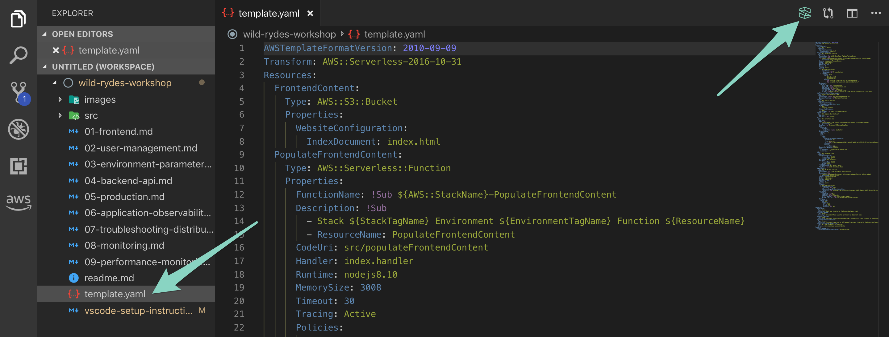
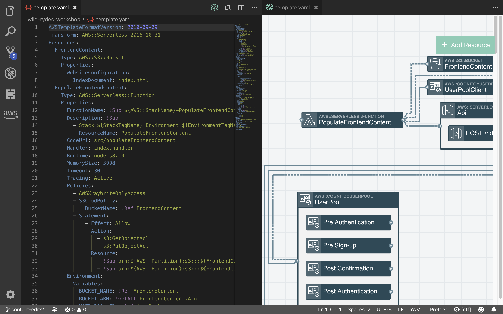

# Stackery VS Code Integration

To use VS Code for this workshop, perform the following steps after completing the [Intro module](readme.md):

1. [Install VS Code](https://code.visualstudio.com/download)
2. Install the **Stackery Serverless Tools** extension by searching for it in the extensions marketplace
3. Clone the repository for the stack you created [using VS Code](https://code.visualstudio.com/docs/editor/versioncontrol#_cloning-a-repository)
4. Open the repo as a workspace
5. Open the `template.yaml` file
6. Click the Stackery icon in the top right to open the editor

7. (Optional) Move the `template.yaml` file to the right or left to open it in split-screen view with the editor

You can now visually edit your template from within VC Code rather than the browser, then `git add`, `commit` and `push` in the VS Code terminal to see your code in the Stackery App.

If you have any problems with setting up or using the **Stackery Serverless Tools** extension for VS Code, please read the [docs for the extension](https://docs.stackery.io/docs/next/ecosystem-integrations/stackery-vscode/).